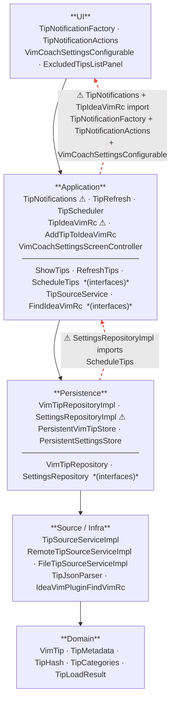

# Layers

Dependency rule: arrows should only point **inward/downward**. Two violations exist today (marked ⚠).

## Fixes

**Violation 1 — `TipNotifications` / `TipIdeaVimRc` → UI layer**
`TipNotifications` and `TipIdeaVimRc` depend on `TipNotificationFactory` and `TipNotificationActions` to build and display notifications. Fix: define a `NotificationFactory` interface in the application layer; have the UI implement it. Remove the direct imports of the concrete UI classes.

The `VimCoachSettingsConfigurable` import is used to open the settings panel from a notification action. Fix: use `ShowSettingsUtil.showSettingsDialog` with a string ID rather than importing the class directly — the ID is already registered in `plugin.xml`.

**Violation 2 — `SettingsRepositoryImpl` → `ScheduleTips`**
When the tip interval or scheduling toggle changes, `SettingsRepositoryImpl` calls `project.service<ScheduleTips>().onSettingsChanged()`. Fix: invert via an observer — emit a `SettingsChangedEvent` or expose a listener list in the persistence layer, and have `TipScheduler` subscribe. Persistence layer stays unaware of Application.
