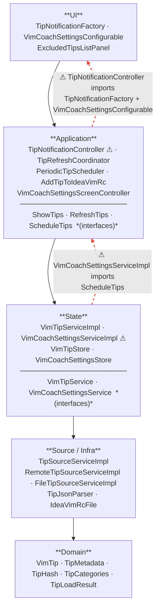

# Layers

Dependency rule: arrows should only point **inward/downward**. Two violations exist today (marked ⚠).

## Fixes

**Violation 1 — `TipNotificationController` → `TipNotificationFactory`**
`TipNotificationFactory` is already injected via `injectedNotificationFactory`. The fix is to depend on an interface (`NotificationFactory`) defined in the application layer and have the UI implement it — removing the direct import of the UI class.

The `VimCoachSettingsConfigurable` import is used to open the settings panel from a notification action. Fix: use IntelliJ's `ShowSettingsUtil.showSettingsDialog` with a string ID rather than importing the class directly.

**Violation 2 — `VimCoachSettingsServiceImpl` → `ScheduleTips`**
The settings service calls the scheduler when interval/enabled changes. Fix: invert via an observer — the settings service emits a `SettingsChangedEvent` (or exposes a listener list), and `PeriodicTipScheduler` subscribes. State layer stays unaware of Application.
