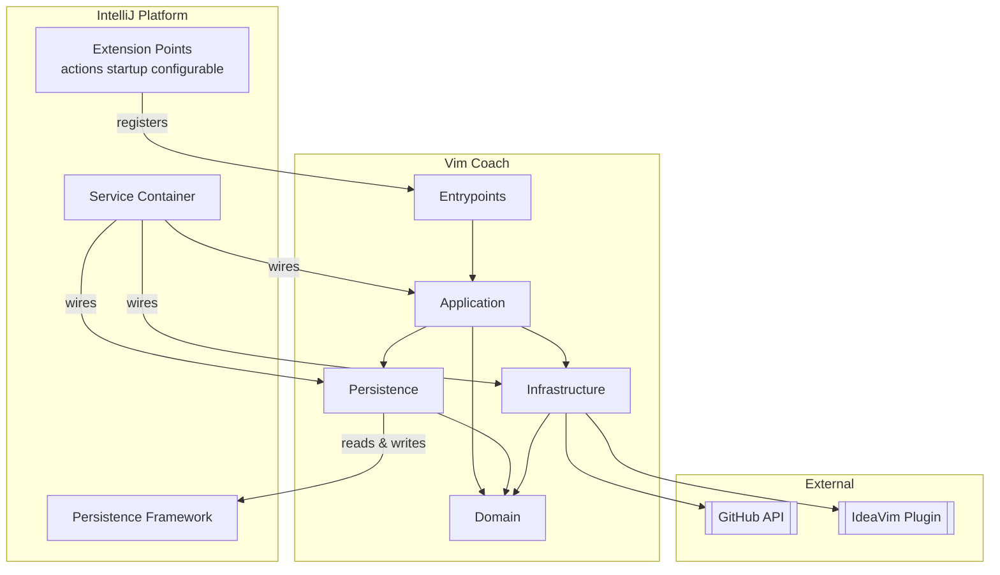

# Architecture Overview

## Eagle-Eye View

The plugin sits entirely inside IntelliJ. Entrypoints are registered as extension points (actions, startup activity, settings configurable). At runtime, IntelliJ's service container wires the application and persistence layers together. The only external network dependency is the GitHub Contents API for fetching tip updates. IdeaVim is an optional runtime dependency used only for `.ideavimrc` file discovery and reload.

## Layers

| Layer | Responsibility | IntelliJ dependency |
|-------|---------------|---------------------|
| **Entrypoints** | Translate IDE events into application calls | Heavy — `AnAction`, `ProjectActivity`, `Configurable` |
| **Application** | Orchestrate use cases; own only deliberate in-memory state (e.g. tip rotation) | Light — `service<T>()`, `invokeLater` |
| **Persistence** | Read and write durable state | Medium — `PersistentStateComponent` |
| **Infrastructure** | Integrate with external systems | Medium — HTTP, VFS, Document API |
| **Domain** | Data types and result shapes | None |

Dependencies only flow inward. Entrypoints depend on application interfaces; application depends on persistence and infrastructure interfaces; everything depends on domain. Domain has no dependencies at all.

## Key Decisions

### Feature-first package structure
Code is organized by feature first (`features/tips/`), then by layer within it. Shared utilities live in `core/shared/` only when genuinely reused. This keeps all code for a capability co-located and makes it easy to follow a slice end to end.

### Interface seams at layer boundaries
Every layer boundary is an interface (`ShowTips`, `RefreshTips`, `ScheduleTips`, `VimTipRepository`, `SettingsRepository`, `TipSourceService`, `FindIdeaVimRc`, `TipNotifier`). Implementations live alongside them — except `TipNotifier`, whose adapter (`IntelliJTipNotifier`) lives in the UI layer so the application stays free of IntelliJ `Notification` types. This is what makes the rest of the decisions possible.

### Dual-constructor dependency injection
Classes have two constructors: a primary one that resolves dependencies via `service<T>()` at runtime, and an internal one that accepts injected instances for tests. This avoids the need for IntelliJ test fixtures in most tests and keeps the production wiring implicit.

### Application vs project service scope
Application services hold state shared across all open projects (tip cache, settings). Project services hold per-project state (the `TipNotifier` adapter and its notification tracker, periodic scheduler). Mixing these up causes either stale cross-project state or unnecessary duplication.

### Stores are dumb
`PersistentStateComponent` implementations (`PersistentVimTipStore`, `PersistentSettingsStore`) are plain state snapshots with no logic. Derivation and normalization that belong to persisted data (e.g. rebuilding `TipCategories` from stored tips) happens in the repository layer above them. This keeps persistence concerns separate from business rules.

### Selection policy lives in the application layer
`VimTipRepository` is a plain query surface with no `SettingsRepository` dependency. "Which tip does the user see next" — category, exclusion, config, and advanced-tips filtering, plus the no-repeat rotation — is owned entirely by `SelectNextTip` (`features/tips/application/selection`), the single chokepoint every entry point goes through. See [Tip Selection](../features/show-tip.md#tip-selection).
