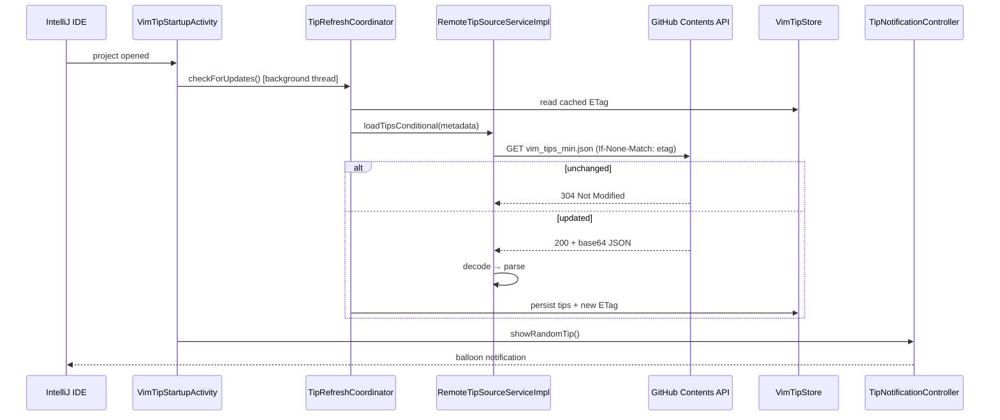

# Tip Loading Sequence

What happens on project open — background refresh + startup tip.

```mermaid
sequenceDiagram
    participant IDE as IntelliJ IDE
    participant SA as VimTipStartupActivity
    participant COORD as TipRefreshCoordinator
    participant SRC as RemoteTipSourceServiceImpl
    participant GH as GitHub Contents API
    participant STORE as VimTipStore
    participant NOTIF as TipNotificationController

    IDE->>SA: project opened
    SA->>COORD: checkForUpdates() [background thread]
    COORD->>STORE: read cached ETag
    COORD->>SRC: loadTipsConditional(metadata)
    SRC->>GH: GET vim_tips_min.json (If-None-Match: etag)
    alt unchanged
        GH-->>SRC: 304 Not Modified
    else updated
        GH-->>SRC: 200 + base64 JSON
        SRC->>SRC: decode → parse
        COORD->>STORE: persist tips + new ETag
    end
    SA->>NOTIF: showRandomTip()
    NOTIF-->>IDE: balloon notification
```
