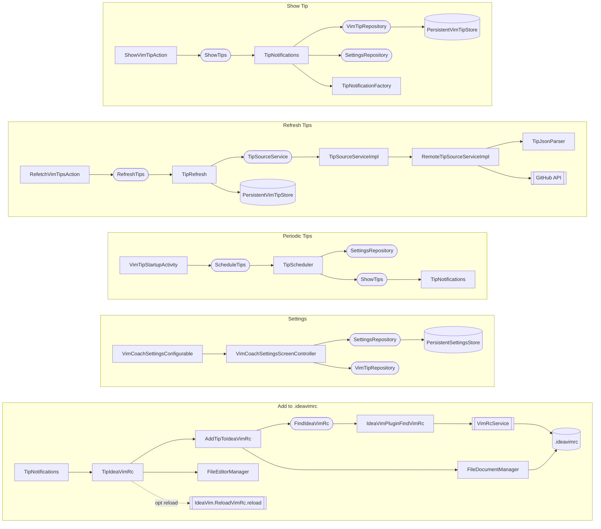

# Vertical Slices

Each row is one user-facing capability — every class involved left to right.

```mermaid
graph TD
    subgraph showTip["Show Tip"]
        direction LR
        A1[ShowVimTipAction]
        A2([ShowTips])
        A3[TipNotifications]
        A4([VimTipRepository])
        A5([SettingsRepository])
        A6[TipNotificationFactory]
        A7[(PersistentVimTipStore)]
        A1 --> A2 --> A3
        A3 --> A4 & A5 & A6
        A4 --> A7
    end

    subgraph refresh["Refresh Tips"]
        direction LR
        B1[RefetchVimTipsAction]
        B2([RefreshTips])
        B3[TipRefresh]
        B4([TipSourceService])
        B5[TipSourceServiceImpl]
        B6[RemoteTipSourceServiceImpl]
        B7[TipJsonParser]
        B8[[GitHub API]]
        B9[(PersistentVimTipStore)]
        B1 --> B2 --> B3
        B3 --> B4 & B9
        B4 --> B5 --> B6
        B6 --> B7 & B8
    end

    subgraph periodic["Periodic Tips"]
        direction LR
        C1[VimTipStartupActivity]
        C2([ScheduleTips])
        C3[TipScheduler]
        C4([SettingsRepository])
        C5([ShowTips])
        C6[TipNotifications]
        C1 --> C2 --> C3
        C3 --> C4 & C5
        C5 --> C6
    end

    subgraph settings["Settings"]
        direction LR
        D1[VimCoachSettingsConfigurable]
        D2[VimCoachSettingsScreenController]
        D3([SettingsRepository])
        D4([VimTipRepository])
        D5[(PersistentSettingsStore)]
        D1 --> D2
        D2 --> D3 & D4
        D3 --> D5
    end

    subgraph ideavimrc["Add to .ideavimrc"]
        direction LR
        E1[TipNotifications]
        E2[TipIdeaVimRc]
        E3[AddTipToIdeaVimRc]
        E4([FindIdeaVimRc])
        E5[IdeaVimPluginFindVimRc]
        E6[[VimRcService]]
        E7[(.ideavimrc)]
        E8[FileDocumentManager]
        E9[FileEditorManager]
        E10[[IdeaVim.ReloadVimRc.reload]]
        E1 --> E2 --> E3
        E3 --> E4 --> E5 --> E6 --> E7
        E3 --> E8 --> E7
        E2 --> E9
        E2 -.->|opt reload| E10
    end

    showTip ~~~ refresh ~~~ periodic ~~~ settings ~~~ ideavimrc
```
