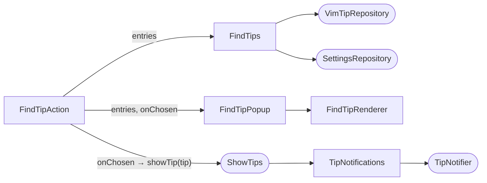

# Find Tip

Lets the user look up any tip on purpose instead of waiting for the rotation to draw it. `Vim Coach: Find Tip…` (from Find Action, or an IdeaVim `<Action>` mapping) opens a searchable popup over every cached tip. Typing filters the list, and Enter shows the chosen tip as the normal tip balloon. Escape clears the query, and Escape again closes the popup with no side effects.

## Components

- **`FindTipAction`** (entrypoint) creates a `FindTips`, logs the entry count at debug level, and hands the entries to `FindTipPopup`. Its `onChosen` callback calls `ShowTips.showTip(tip)`. It is enabled only when there is a project. An internal constructor injects the `FindTips` factory, the popup (through the small `FindTipView` interface) and the `ShowTips` lookup, so tests can drive both branches without showing a popup.
- **`FindTips`** (application, `features/tips/application/search`) is a plain class, not a service. Following the dual-constructor pattern, its no-arg constructor resolves `VimTipRepository` and `SettingsRepository` via `service<T>()`, and an internal one takes instances. `entries()` returns one `FindTipEntry(tip, muted, searchText)` per cached tip, in `VimTipRepository.getTips()` order.
- **`FindTipPopup`** (UI, `features/tips/ui/find`) implements `FindTipView` and builds the chooser with `JBPopupFactory.createPopupChooserBuilder`. It holds no application logic: it receives the entries and an `onChosen: (VimTip) -> Unit` callback.
- **`ShowTips.showTip(tip)`** shows the chosen tip through the same balloon path as a random tip. See [Show Tip](show-tip.md).

## What the User Sees

The popup is titled **Find Vim Tip** and opens centred in the current window with its search field already visible (`setFilterAlwaysVisible`). It is movable and resizable. Rows start in corpus order, with no sorting.

Choosing a row closes the popup and shows that tip as the usual balloon with its usual buttons: **Next**, **Mute**, and the Apply-to-`.ideavimrc` button when the tip has config lines and IdeaVim is installed (see [Add to .ideavimrc](ideavimrc-button.md)). **Next** on that balloon goes back to the normal random rotation.

## Search Scope

Find searches **every** cached tip. The settings that shape the random rotation do not apply here, because they decide what Vim Coach volunteers, not what the user may look up:

| Rotation filter | In Find Tip |
|-----------------|-------------|
| Category filters | Ignored. The tip's categories are shown as a label. |
| "Show advanced tips" opt-in | Ignored. Advanced tips carry the `Advanced` label. |
| Muted (excluded) tips | Still listed, with a `Muted` label. |
| Config tips without IdeaVim | Still listed and shown. The balloon has no Apply button, because `TipIdeaVimRc.getAction(tip)` returns null when IdeaVim is absent. That check is what keeps the button away here, since a hand-picked tip never passes the rotation's config filter. See [Add to .ideavimrc](ideavimrc-button.md). |

The popup filters on `FindTipEntry.searchText` via the platform speed search, which matches case-insensitively. It is one string that joins, with spaces, the summary, every detail line, every category, the mnemonic (if any), the mode label (`Insert mode`, `Visual mode`, `Command mode`, if any), the word `advanced` for advanced tips and the word `muted` for muted tips. So typing `insert`, `registers`, `advanced` or `muted` narrows the list as well as words from the tip text. The text keeps its original case, because lower-casing it would lose camel-hump word starts such as `NERDTree`.

A muted tip can be re-shown and muted again from its balloon. `SettingsRepository.hideTip` ignores a hash that is already hidden, so this never stores a duplicate.

## Selection and Rotation

A hand-picked tip **bypasses** `SelectNextTip` and its filter chain, and does **not** touch `TipRotation`. It is not marked as shown for the no-repeat cycle, so the rotation may still draw it later in the same session.

The advanced-tips nudge still runs, because it lives in `TipNotifications.showTip` and runs after every shown tip. A hand-picked tip therefore counts toward the three-tip threshold exactly like a random one, and can be the tip after which the one-time nudge appears. See [Advanced Tips Marker and Nudge](show-tip.md#advanced-tips-marker-and-nudge).

## Empty Cache

When the repository holds no tips, the action does not open the chooser. It shows a small message popup (`JBPopupFactory.createMessage`) saying no tips are loaded yet and pointing at `Vim Coach: Refresh Tips`.

## Row Rendering

`FindTipRenderer` draws each row as two lines of `SimpleColoredComponent`s. Colours come from `RenderingUtil.getBackground(list, selected)` and `RenderingUtil.getForeground(list, selected)`, so rows match the popup's own background rather than the theme's plain list background. The row is wrapped in a `SelectablePanel` configured by `PopupUtil.configListRendererFlexibleHeight`, which paints the rounded, inset selection the platform's own popups use. `SelectablePanel` is marked `@ApiStatus.Experimental`, and it is applied in the classic UI as well.

- **Top line.** The summary at regular weight on the left. A dimmed label tail sits on the right.
- **Second line.** The first detail line, dimmed. It is empty when the tip has no details.

Speed-search match highlighting is applied to all three texts, so a row matched through its labels or detail line shows where it matched. Each row also gets an accessible name made of the summary, the label tail and the detail line, joined with spaces, so screen readers announce the whole row.

The label tail joins, with ` · `, only the labels that apply, in this order: `Advanced`, the mode label, `Muted`, then the categories joined with `, `. For example: `Advanced · Insert mode · Muted · editing, registers`. Dimmed text uses `SimpleTextAttributes.GRAYED_ATTRIBUTES`.

Rows are plain text. Vim keys are deliberately not coloured or highlighted.
