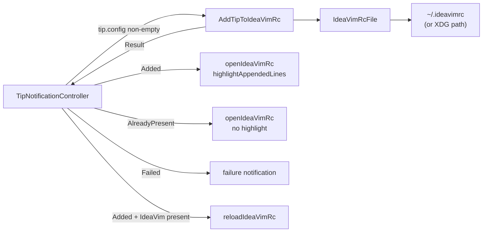
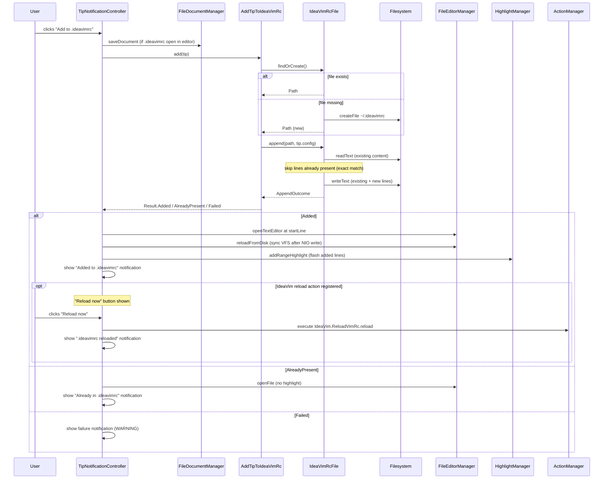

# Add to .ideavimrc

When a tip has configuration lines (e.g. `set surround`, `Plug 'tpope/vim-surround'`), an **"Add to .ideavimrc"** action button appears on the tip notification. Clicking it appends those lines to the user's `.ideavimrc`, opens the file in the editor at the added lines, and offers a **"Reload now"** button if IdeaVim's reload action is available.

## Vertical Slice

## Flow on Button Click

## File Discovery

`IdeaVimRcFile` mirrors IdeaVim's own `VimRcService` search order:

| Priority | Path |
|----------|------|
| 1 | `~/.ideavimrc` |
| 2 | `~/_ideavimrc` |
| 3 | `$XDG_CONFIG_HOME/ideavim/ideavimrc` (defaults to `~/.config/ideavim/ideavimrc`) |

If none exists, `findOrCreate()` creates `~/.ideavimrc` (first candidate that succeeds).

IdeaVim is not a runtime dependency — the search logic is reimplemented to avoid coupling to a submodule.

## Dedup Logic

Before writing, `IdeaVimRcFile.append` reads the file and builds a set of trimmed lines. Any config line already present verbatim is silently skipped — only genuinely new lines are appended.

**Limitation:** dedup is exact-match only. It will not detect semantic equivalents (e.g. `set surround` vs. `Plug 'tpope/vim-surround'` enabling the same feature).

## VFS Sync

NIO writes bypass IntelliJ's Virtual File System, so the open `Document` has stale content after `refreshAndFindFileByNioFile` (which schedules an async reload). `TipNotificationController.syncDocumentFromDisk` calls `reloadFromDisk` directly to make the reload synchronous, ensuring the editor opens at the correct line with up-to-date content.

## Error Paths

| Condition | Result |
|-----------|--------|
| `tip.config` is empty | Button not shown |
| File creation fails (IOException) | `Result.Failed` → warning notification |
| Append fails (IOException) | `Result.Failed` → warning notification |
| All config lines already present | `Result.AlreadyPresent` → file opened, no highlight |
| IdeaVim reload action not registered | "Reload now" button not shown |
| Reload action missing at click time | warning notification |
