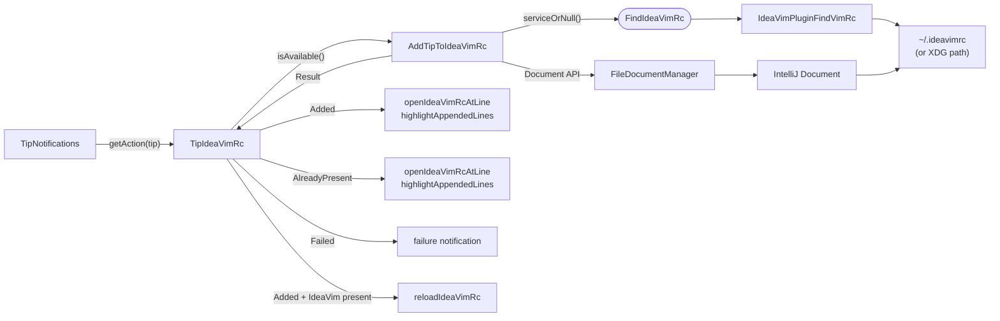
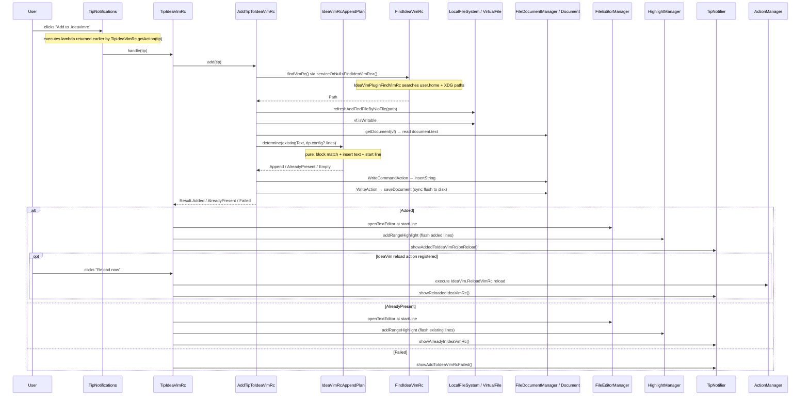

# Add to .ideavimrc

When a tip has configuration lines (e.g. `set surround`, `Plug 'tpope/vim-surround'`) **and** the user has IdeaVim installed **and** a `.ideavimrc` file already exists, an apply action button appears on the tip notification. Clicking it appends those lines to the file, opens it in the editor at the added lines, and offers a **"Reload now"** button if IdeaVim's reload action is available.

The button label comes from the tip's `config`: if `config.name` is set it is used **verbatim** (e.g. `Install vim-surround`); otherwise the generic **"Apply"** label is used. The lines written to the file come from `config.lines`. See the [tip schema](../tips/README.md) for the `config` object shape (and the legacy array form still accepted for back-compat).

File creation is deliberately out of scope — if no `.ideavimrc` exists, the button is simply not shown. The user creates the file through IdeaVim's own "Create ~/.ideavimrc" action.

## Vertical Slice

## Flow on Button Click

Notifications go through the `TipNotifier` port (see [Show Tip](show-tip.md)); `TipIdeaVimRc` itself touches no IntelliJ `Notification` types. `project` is used only for editor IO (open / highlight).

## File Discovery

`FindIdeaVimRc` is an application service interface registered only when IdeaVim is installed (via `plugin-ideavim.xml`), with `IdeaVimPluginFindVimRc` as its implementation. `AddTipToIdeaVimRc` resolves it via `serviceOrNull<FindIdeaVimRc>()` — when IdeaVim is absent the service is not registered, `serviceOrNull` returns null, and `isAvailable()` returns false.

`plugin.xml` declares `IdeaVIM` as an optional dependency for that descriptor, and `gradle.properties` declares the same Marketplace plugin in `platformPlugins`. Keeping both in sync lets IntelliJ resolve `plugin-ideavim.xml` during development and lets the custom run IDE tasks install the same IdeaVim version.

`IdeaVimPluginFindVimRc.findVimRc()` replicates IdeaVim's search order directly using `System.getProperty("user.home")` and `System.getenv("XDG_CONFIG_HOME")`:

| Priority | Path |
|----------|------|
| 1 | `~/.ideavimrc` |
| 2 | `~/_ideavimrc` |
| 3 | `$XDG_CONFIG_HOME/ideavim/ideavimrc` (defaults to `~/.config/ideavim/ideavimrc`) |

Only paths that already exist on disk are returned; `null` means no file was found.

## Why Document API

All writes go through IntelliJ's `Document` + `WriteCommandAction` rather than NIO:

- **Windows compatibility**: IntelliJ holds an exclusive file lock on open documents. A raw NIO write would fail with an access error. The Document API is the platform's own abstraction over this.
- **Line endings**: Document API normalises line endings per platform automatically — no `System.lineSeparator()` differences.
- **No VFS sync needed**: the Document is always current; `reloadFromDisk` is unnecessary.
- **Undo support**: `WriteCommandAction` registers the change in IntelliJ's undo stack.

After `WriteCommandAction`, the document is saved synchronously via `WriteAction { saveDocument(doc) }` so IdeaVim's "Reload now" reads the up-to-date file from disk immediately.

## Append Planning

Before writing, `AddTipToIdeaVimRc.add` reads `document.text` and hands it with `tip.config?.lines` to `IdeaVimRcAppendPlan.determine()` — a pure, IDE-free function that decides what to append. A tip's config is treated as a **single, indivisible snippet**: config lines are trimmed and blank lines dropped, then the snippet is matched against the file as a contiguous run of trimmed lines, in order. The result is one of:

- **`AlreadyPresent(startLine, lineCount)`** — the whole block already exists; nothing is written. The 0-based start line and line span of the existing block are returned so the caller can re-highlight it.
- **`Append(insertText, startLine, addedCount)`** — the snippet is copied in full (verbatim, preserving order and any repeated lines), along with the 0-based start line of the first appended line and the added-line count.
- **`Empty`** — the config had no usable (non-blank) lines.

It deliberately does **not** append "just the missing lines": a snippet whose lines exist but are scattered or reordered is re-appended in full, since a snippet may rely on its lines being together and in order. Keeping this logic free of `Document`/VFS types makes the branching unit-testable (`IdeaVimRcAppendPlanUnitTest`); `add()` is left to do only the IO.

### Vim Coach stamp

When appending, a vimscript comment is written **above** the snippet so the user can tell which lines Vim Coach added — `AddTipToIdeaVimRc.stampFor` produces `" <name> — added by Vim Coach` when the tip's `config.name` is set, or `" Added by Vim Coach` otherwise. The stamp counts toward `addedCount` so the highlight covers the whole inserted block (stamp + lines).

The stamp is **not** part of the already-present match: `findBlockStart` keys off the real config lines only. A snippet that was previously added with a stamp is still recognised on a re-add — neither the lines nor a second stamp are duplicated.

**Limitation:** block matching is exact-match only. It will not detect semantic equivalents (e.g. `set surround` vs. `Plug 'tpope/vim-surround'` enabling the same feature). Key-aware dedup is tracked as future work.

## Error Paths

| Condition | Result |
|-----------|--------|
| IdeaVim not installed | Button not shown |
| `.ideavimrc` does not exist | Button not shown |
| `tip.config` absent or `config.lines` empty | Button not shown |
| `VirtualFile` not found | `Result.Failed` → warning notification |
| File not writable | `Result.Failed` → warning notification |
| `Document` unavailable | `Result.Failed` → warning notification |
| All config lines already present | `Result.AlreadyPresent` → file opened at the existing lines, briefly highlighted |
| IdeaVim reload action not registered | "Reload now" button not shown |
