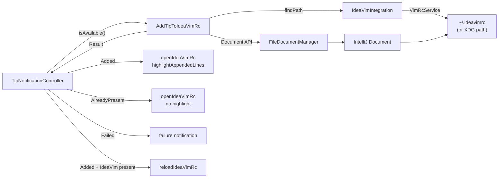
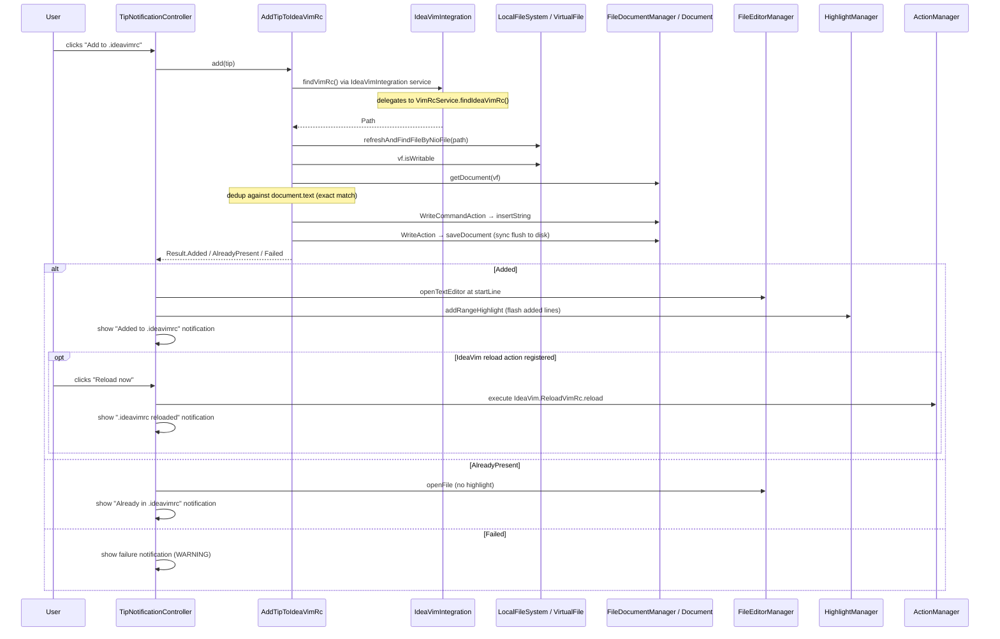

# Add to .ideavimrc

When a tip has configuration lines (e.g. `set surround`, `Plug 'tpope/vim-surround'`) **and** the user has IdeaVim installed **and** a `.ideavimrc` file already exists, an **"Add to .ideavimrc"** action button appears on the tip notification. Clicking it appends those lines to the file, opens it in the editor at the added lines, and offers a **"Reload now"** button if IdeaVim's reload action is available.

File creation is deliberately out of scope — if no `.ideavimrc` exists, the button is simply not shown. The user creates the file through IdeaVim's own "Create ~/.ideavimrc" action.

## Vertical Slice

## Flow on Button Click

## File Discovery

`IdeaVimIntegration` is an application service registered only when IdeaVim is installed (via `plugin-ideavim.xml`). Its implementation delegates to `VimRcService.findIdeaVimRc()` which uses IdeaVim's own search order:

| Priority | Path |
|----------|------|
| 1 | `~/.ideavimrc` |
| 2 | `~/_ideavimrc` |
| 3 | `$XDG_CONFIG_HOME/ideavim/ideavimrc` (defaults to `~/.config/ideavim/ideavimrc`) |

When `IdeaVimIntegration` service is absent (IdeaVim not installed), `isAvailable()` returns false and the button is never shown.

## Why Document API

All writes go through IntelliJ's `Document` + `WriteCommandAction` rather than NIO:

- **Windows compatibility**: IntelliJ holds an exclusive file lock on open documents. A raw NIO write would fail with an access error. The Document API is the platform's own abstraction over this.
- **Line endings**: Document API normalises line endings per platform automatically — no `System.lineSeparator()` differences.
- **No VFS sync needed**: the Document is always current; `reloadFromDisk` is unnecessary.
- **Undo support**: `WriteCommandAction` registers the change in IntelliJ's undo stack.

After `WriteCommandAction`, the document is saved synchronously via `WriteAction { saveDocument(doc) }` so IdeaVim's "Reload now" reads the up-to-date file from disk immediately.

## Dedup Logic

Before writing, `AddTipToIdeaVimRc.add` reads `document.text` and builds a set of trimmed existing lines. Any config line already present verbatim is skipped — only genuinely new lines are appended. Duplicate lines within the tip's own config list are also collapsed.

**Limitation:** dedup is exact-match only. It will not detect semantic equivalents (e.g. `set surround` vs. `Plug 'tpope/vim-surround'` enabling the same feature).

## Error Paths

| Condition | Result |
|-----------|--------|
| IdeaVim not installed | Button not shown |
| `.ideavimrc` does not exist | Button not shown |
| `tip.config` is empty | Button not shown |
| `VirtualFile` not found | `Result.Failed` → warning notification |
| File not writable | `Result.Failed` → warning notification |
| `Document` unavailable | `Result.Failed` → warning notification |
| All config lines already present | `Result.AlreadyPresent` → file opened, no highlight |
| IdeaVim reload action not registered | "Reload now" button not shown |
