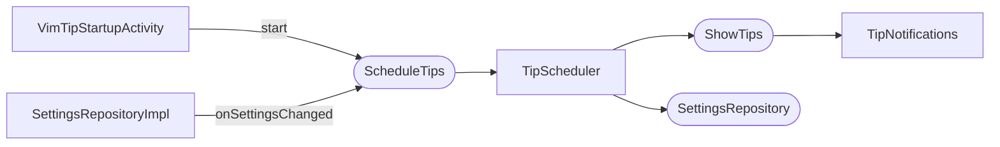

# Periodic Tips

Shows a tip on a recurring schedule while a project is open. The scheduler is a project service, so each open project window has its own instance and its own timer.

## Components



## Timer Mechanism

`TipScheduler` does **not** use a fixed-rate executor. Instead, each tick schedules exactly one follow-up tick after it fires:

```
start() → schedule(interval) → [tick fires] → reschedule() → schedule(interval) → ...
```

This design means:
- If the project is disposed between ticks, `reschedule()` detects it and the chain stops naturally.
- Exceptions in one tick are caught and logged; they don't kill the scheduler.
- `onSettingsChanged()` can cancel the pending timer and re-arm at any point without racing a fixed-rate future.

## Lifecycle

`TipScheduler` implements `Disposable`. IntelliJ calls `dispose()` when the project closes, which cancels the pending `ScheduledFuture`. There is no leak.

At startup, `VimTipStartupActivity` calls `scheduleTips.start()` only if `isPeriodicTipsEnabled()` is true at that moment. If the user enables periodic tips later via Settings, the scheduler is started by `onSettingsChanged()`.

## Settings Changes

`SettingsRepositoryImpl` calls `onSettingsChanged()` on all open projects whenever `periodicTipsEnabled` or `tipIntervalHours` changes. `TipScheduler.onSettingsChanged()` calls `reschedule()`, which cancels any pending timer and arms a new one with the updated interval immediately.

## Skipping Active Notifications

The scheduler calls `showTips.showRandomTipIfNoneActive()` rather than `showRandomTip()`. If a tip balloon is already visible, the periodic tick is skipped silently and logged. The timer still re-arms normally — the skipped tick does not shift the schedule.

## Interval

The configured value is in hours. `resolveScheduleConfigOrNull()` enforces that the computed seconds value is positive and caps the interval at 168 hours (1 week).

In development, the JVM property `vimcoach.tip.interval.unit=minutes` makes the scheduler treat the stored hours value as minutes, allowing fast testing without touching the settings UI.
