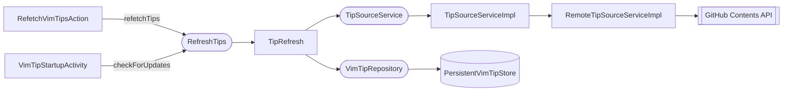

# Refresh Tips

Fetches the tip corpus from GitHub and persists it locally. There are two triggers with different fetch strategies.

## Components

## Two Triggers, Two Strategies

| Trigger | Method | Fetch type |
|---------|--------|-----------|
| "Vim Coach: Refresh Tips" action | `refetchTips()` | Always unconditional (full download) |
| Project open (`VimTipStartupActivity`) | `checkForUpdates()` | Conditional if cache is usable; unconditional otherwise |

`checkForUpdates()` also has a **once-per-session guard**: an `AtomicBoolean` inside `TipRefresh` means only the first call proceeds. Subsequent calls within the same IDE session return `NotModified` immediately. Since `RefreshTips` is an application service, this is JVM-wide — opening a second project window doesn't trigger a second network request.

`checkForUpdates()` falls back to unconditional if either condition is false:
- cached tip count is zero
- cached categories are empty (indicates a pre-category legacy cache)

## Conditional vs Unconditional

A conditional fetch sends `If-None-Match: <etag>` to the GitHub Contents API. A 304 response means the file hasn't changed; only `lastFetchTimestamp` is updated. A 200 response includes the new content and a new ETag.

## Result Types

The fetch pipeline crosses two layer boundaries, each with its own result type:

- `TipSourceLoadResult` — returned by the source adapter (`RemoteTipSourceServiceImpl`). Carries raw tips and metadata on success.
- `TipLoadResult` — returned by `TipRefresh` to callers. Carries only a tip count on success; hides internal source details.

`TipRefresh.toTipLoadResult()` translates between the two and handles persistence as a side effect.

## What Gets Persisted

On a successful update, `TipRefresh` writes to `PersistentVimTipStore` via `VimTipRepository`:

| Field | Value |
|-------|-------|
| `tips` | full parsed list |
| `categories` | derived immediately via `TipCategories.fromTips()` and co-stored |
| `metadata.etag` | from GitHub response header |
| `metadata.githubSha` | from GitHub response body |
| `metadata.lastFetchTimestamp` | current time |

On a 304 Not Modified, only `lastFetchTimestamp` is updated.

## Storage

`PersistentVimTipStore` is annotated with `@State(storage = CACHE_FILE, roamingType = DISABLED)`. Tips are stored in the IDE's local cache directory and are never synced across machines via Settings Sync.
