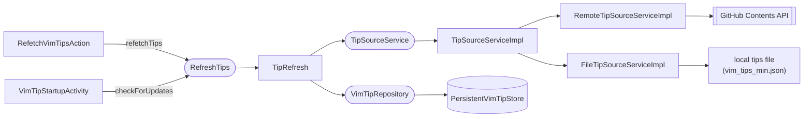

# Refresh Tips

Fetches the tip corpus from GitHub and persists it locally. There are two triggers with different fetch strategies.

## Components

## Source Selection

`TipSourceServiceImpl` chooses between two adapters based on the `vimcoach.tip.source`
JVM property:

| `vimcoach.tip.source` | Adapter | Used by |
|-----------------------|---------|---------|
| unset / anything else | `RemoteTipSourceServiceImpl` (GitHub) | production, default |
| `file` | `FileTipSourceServiceImpl` | local dev via the `runIdeWithFileTips` Gradle task |

In `file` mode the source path comes from `vimcoach.tip.file.path` (required, or
loading fails), and the parsed result carries an empty `TipMetadata` — so there is
no ETag/SHA and conditional fetches degrade to plain reads. See
[tips-pipeline.md](../tips/tips-pipeline.md) for how the local file is generated. Both
adapters share `TipJsonParser`.

## Two Triggers, Two Strategies

| Trigger | Method | Fetch type |
|---------|--------|-----------|
| "Vim Coach: Refresh Tips" action | `refetchTips()` | Always unconditional (full download) |
| Project open (`VimTipStartupActivity`) | `checkForUpdates()` | Conditional if cache is usable; unconditional otherwise |

`checkForUpdates()` also has a **once-per-session guard**: an `AtomicBoolean` inside `TipRefresh` means only the first call proceeds. Subsequent calls within the same IDE session return `NotModified` immediately. Since `RefreshTips` is an application service, this is JVM-wide — opening a second project window doesn't trigger a second network request.

`checkForUpdates()` falls back to unconditional if any of these hold:
- cached tip count is zero
- cached categories are empty (indicates a pre-category legacy cache)
- the cache was parsed by a different plugin version than the one running
  (`metadata.pluginVersion` mismatch — see [Plugin-version staleness](#plugin-version-staleness))

### Plugin-version staleness

The conditional fetch is keyed only on the **remote bytes** (ETag/SHA). That means a plugin upgrade
which teaches the parser to extract a *new field* from the *same* remote JSON (the first case was
`.ideavimrc` configs in 1.4.0) would otherwise keep serving the stale, under-parsed cache: the
startup check sends the old ETag, GitHub replies `304`, and the new parser never runs. The fix runs
unfetched data through the new parser exactly once after an upgrade.

Every successful save stamps `metadata.pluginVersion` with the running plugin version, read from a
`vimcoach-version.txt` resource baked into the plugin jar at build time (the `generateVersionResource`
task in `build.gradle.kts`). The IDE plugin-registry APIs that expose a descriptor's version
(`PluginManagerCore.getPlugin`, `PluginManager.findEnabledPlugin`) are `@ApiStatus.Internal` and
rejected by the Plugin Verifier, so the version is resolved from the bundled resource instead.
On startup, `checkForUpdates()` forces an **unconditional** fetch whenever the
cached `pluginVersion` differs from the running one, so the upgraded parser re-runs against the
remote content. Legacy caches have no stored version (`null`) and self-heal on the first run of an
upgraded build. The cost is one extra `200` (instead of a `304`) per upgrade, once per session — the
ETag optimization is preserved for every same-version startup. If the running version can't be
resolved (`null`), the check stays conditional rather than refetch on every startup.

## Conditional vs Unconditional

A conditional fetch sends `If-None-Match: <etag>` to the GitHub Contents API. A 304 response means the file hasn't changed; only `lastFetchTimestamp` is updated. A 200 response includes the new content and a new ETag.

## Result Types

The fetch pipeline crosses two layer boundaries, each with its own result type:

- `TipSourceLoadResult` — returned by the source adapter (`RemoteTipSourceServiceImpl`). Carries raw tips and metadata on success.
- `TipLoadResult` — returned by `TipRefresh` to callers. Carries only a tip count on success; hides internal source details.

`TipRefresh.toTipLoadResult()` translates between the two and handles persistence as a side effect.

## What Gets Persisted

On a successful update, `TipRefresh` writes to `PersistentVimTipStore` via `VimTipRepository`:

| Field | Value |
|-------|-------|
| `tips` | full parsed list |
| `categories` | derived immediately via `TipCategories.fromTips()` and co-stored |
| `metadata.etag` | from GitHub response header |
| `metadata.githubSha` | from GitHub response body |
| `metadata.lastFetchTimestamp` | current time |
| `metadata.pluginVersion` | running plugin version, read from the build-time `vimcoach-version.txt` resource (drives upgrade-staleness detection) |

On a 304 Not Modified, only `lastFetchTimestamp` is updated.

## Storage

`PersistentVimTipStore` is annotated with `@State(storage = CACHE_FILE, roamingType = DISABLED)`. Tips are stored in the IDE's local cache directory and are never synced across machines via Settings Sync.
