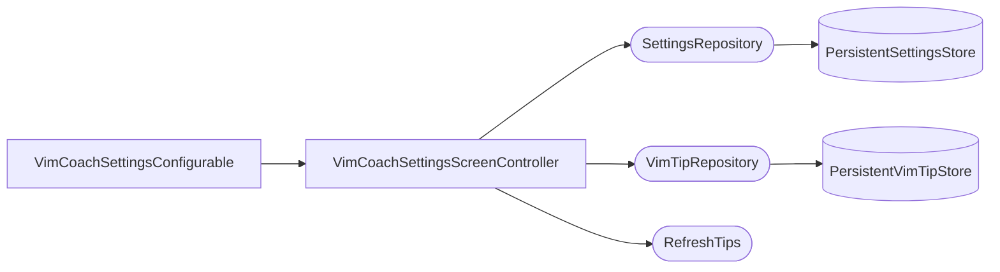

# Settings

Exposes plugin configuration at `Settings | Tools | Vim Coach`. The screen manages startup tips, periodic reminders, category filters, the advanced-tips opt-in, and excluded tips.

## Components



`VimCoachSettingsConfigurable` is the IntelliJ `SearchableConfigurable` extension point — it owns the Swing UI. All logic is in `VimCoachSettingsScreenController`, which is a plain class (not an IntelliJ service).

## State Snapshot Pattern

The settings screen works with a `VimCoachSettingsScreenState` snapshot, not live repository reads. `createComponent()` calls `loadState()` once and stores the snapshot. `apply()` gathers the current UI values via `currentScreenState()` and calls `saveState()`. `reset()` reloads from the controller and re-syncs UI components. `isModified()` compares the current UI snapshot to the last-saved one to drive the Apply button.

## Category Storage

Categories are stored as a **disabled** list, not an enabled list. `getEnabledTipCategories()` computes:

```
enabled = available − disabled
```

This means any category that appears in the tip corpus but is absent from the disabled list is automatically enabled. New categories introduced by a tip refresh are therefore enabled by default without any migration.

## Excluded Tips

The UI shows tip summaries, but the store only holds SHA-256 hashes (`PersistentSettingsStore.hiddenTipHashes`). `loadExcludedTips()` resolves hashes back to summaries via `VimTipRepository.getTipsByHashes()`. Tips whose hashes no longer match any stored tip (e.g. deleted from the corpus) are silently dropped — `mapNotNull` discards them.

Restoring an excluded tip from the UI does **not** call the repository immediately. `ExcludedTipsListPanel` accumulates restored hashes in `restoredExcludedTipHashes` on the screen state. The actual `restoreTip()` calls happen inside `saveState()` when the user clicks Apply.

## Advanced Tips Opt-In

The **"Show advanced tips"** checkbox toggles `PersistentSettingsStore.showAdvancedTips` (default **off**). It is orthogonal to categories: category filters decide *which topics* appear; this toggle decides whether advanced-level tips *within* those topics are included. A pre-feature store has no field and deserializes to off, so existing users see no change until they opt in. See [Show Tip](show-tip.md) for how the toggle gates the rotation, marks advanced tips, and drives the one-time discovery nudge.

## Legacy Category Backfill

`loadAvailableCategories()` checks whether tips are cached but categories are empty. This happens with persistent caches from before category support was added. When detected, a forced `refetchTips()` is triggered during settings open to recover the category data. This is a one-time recovery path.

## Scheduler Notification

`SettingsRepositoryImpl.setPeriodicTipsEnabled()` and `setTipIntervalHours()` both call `notifyPeriodicSchedulerSettingsChanged()` when the value actually changes. That method iterates over all open, non-disposed projects and calls `project.service<ScheduleTips>().onSettingsChanged()`. The scheduler re-arms immediately with the new configuration without waiting for the next project open.
