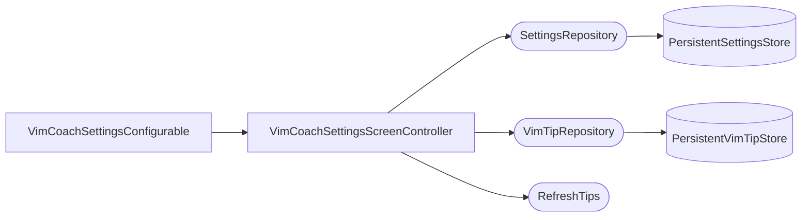

# Settings

Exposes plugin configuration at `Settings | Tools | Vim Coach`. The screen manages startup tips, periodic reminders, category filters, the advanced-tips opt-in, and excluded tips.

## Components


```mermaid
graph LR
    A[VimCoachSettingsConfigurable] --> B[VimCoachSettingsScreenController]
    B --> C([SettingsRepository])
    B --> D([VimTipRepository])
    B --> E([RefreshTips])
    C --> F[(PersistentSettingsStore)]
    D --> G[(PersistentVimTipStore)]
```

`VimCoachSettingsConfigurable` is the IntelliJ `SearchableConfigurable` extension point — it owns the Swing UI. All logic is in `VimCoachSettingsScreenController`, which is a plain class (not an IntelliJ service).

## State Snapshot Pattern

The settings screen works with a `VimCoachSettingsScreenState` snapshot, not live repository reads. `createComponent()` calls `loadState()` once and stores the snapshot. `apply()` gathers the current UI values via `currentScreenState()` and calls `saveState()`. `reset()` reloads from the controller and re-syncs UI components. `isModified()` compares the current UI snapshot to the last-saved one to drive the Apply button.

## Per-Machine Storage

`PersistentSettingsStore` uses `roamingType = DISABLED`, so `vim-coach-settings.xml` is never shared through Settings Sync, the same as the tip cache and the rotation file. Each machine keeps its own toggles, categories, exclusions and one-time hints. The file name and location didn't change, so existing local settings carry over. Before 1.6.0 the file roamed. Turning roaming off also stops a 1.6.0 machine, whose saved file has no `hiddenTipHashes` once migrated, from syncing that file to a machine still on 1.5.1 and wiping its exclusions.

## Category Storage

Categories are stored as a **disabled** list, not an enabled list. `getEnabledTipCategories()` computes:

```
enabled = available − disabled
```

This means any category that appears in the tip corpus but is absent from the disabled list is automatically enabled. New categories introduced by a tip refresh are therefore enabled by default without any migration.

## Excluded Tips

The UI shows tip summaries, but the store only holds generated tip ids (`PersistentSettingsStore.hiddenTipIds`). `loadExcludedTips()` resolves ids back to summaries via `VimTipRepository.getTipsByIds()`. Ids that no longer match any stored tip (deleted from the corpus, or reworded so the id changed) are silently dropped — `mapNotNull` discards them.

### Migrating exclusions from before 1.6.0

<!-- TODO(1.6.0 upgrade bridge) -->

Before 1.6.0 an exclusion was the SHA-256 of the tip's trimmed summary, stored in `hiddenTipHashes`. The store still reads that field so 1.6.0 can migrate it. After every successful fetch, `TipRefresh` calls `SettingsRepository.migrateLegacyHiddenTips(tips)`. It adds the id of each fetched tip whose summary hash is in the legacy list to `hiddenTipIds`, then clears `hiddenTipHashes` in the same write.

- It runs after a fetch, not on load: the upgrade drops the id-less tip cache (see [Tips pipeline](../tips/tips-pipeline.md#tip-ids)), so until a fetch succeeds there are no ids to map to. An empty tip list leaves the legacy hashes alone, and the next session retries.
- Hashes that match no fetched tip are dropped. That happens only when the summary changed or the tip was removed, and 1.5.x would have stopped hiding that tip too.
- A downgrade to 1.5.x after the migration finds no `hiddenTipHashes` and shows every tip again.

Restoring an excluded tip from the UI does **not** call the repository immediately. `ExcludedTipsListPanel` accumulates restored ids in `restoredExcludedTipIds` on the screen state. The actual `restoreTip()` calls happen inside `saveState()` when the user clicks Apply.

## Advanced Tips Opt-In

The **"Show advanced tips"** checkbox toggles `PersistentSettingsStore.showAdvancedTips` (default **off**). It is orthogonal to categories: category filters decide *which topics* appear; this toggle decides whether advanced-level tips *within* those topics are included. A pre-feature store has no field and deserializes to off, so existing users see no change until they opt in. See [Show Tip](show-tip.md) for how the toggle gates the rotation, marks advanced tips, and drives the one-time discovery nudge.

## Legacy Category Backfill

<!-- TODO(1.6.0 upgrade bridge) -->

`loadAvailableCategories()` checks whether tips are cached but categories are empty. This happens with persistent caches from before category support was added. When detected, a forced `refetchTips()` is triggered during settings open to recover the category data. This is a one-time recovery path.

## Scheduler Notification

`SettingsRepositoryImpl.setPeriodicTipsEnabled()` and `setTipIntervalHours()` both call `notifyPeriodicSchedulerSettingsChanged()` when the value actually changes. That method iterates over all open, non-disposed projects and calls `project.service<ScheduleTips>().onSettingsChanged()`. The scheduler re-arms immediately with the new configuration without waiting for the next project open.
