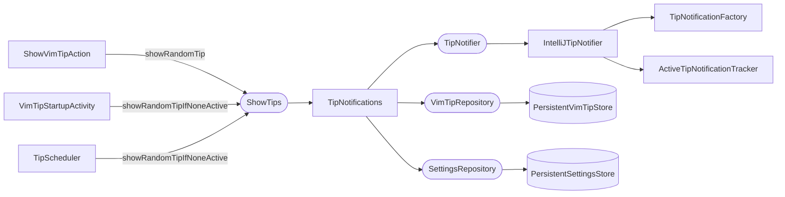

# Show Tip

Displays a random tip as an IntelliJ balloon notification. The same flow is triggered by three entry points: the `ShowVimTipAction` (user-invoked from Find Action), startup (after the tip cache is refreshed), and the periodic scheduler.

## Components



`ShowTips` is a project service. `TipNotifications` is its implementation. The interface has two methods:

- `showRandomTip()` — always shows a tip, expiring any currently visible one first.
- `showRandomTipIfNoneActive()` — skips silently if a tip balloon is already visible. Used by startup and the periodic scheduler so they don't interrupt the user.

## Notification Port

`TipNotifications` (application layer) speaks only to the `TipNotifier` port — a platform-agnostic interface (`showTip`, `showTipExcluded`, `hasVisibleTip`, the `.ideavimrc` result messages). It holds **no** IntelliJ `Notification` types: wording, balloon rendering, and the active-notification lifecycle all live behind the port. This is the seam that lets the notification presentation be swapped (e.g. a different layout or surface) without touching application code, and it is what makes `TipNotifications` unit-testable against a fake.

`IntelliJTipNotifier` (UI layer) is the production adapter, registered as a project service (`TipNotifier` → `IntelliJTipNotifier`). It renders via `TipNotificationFactory`, owns the `ActiveTipNotificationTracker`, and is the only place that calls `Notification.notify()` / `expire()`.

## Tip Selection

`selectRandomTip()` in `TipNotifications` does three things before calling `.random()`:

1. **Category filter**: asks `SettingsRepository` for the enabled categories, then calls `VimTipRepository.getRandomTip(enabledCategories, includeConfigTips)`. If no categories are available yet (tips not loaded), falls back to `getRandomTip(includeConfigTips)` with no category filter.

2. **Config filter**: `includeConfigTips` is `ideaVimAvailable()` — true only when IdeaVim is installed. When IdeaVim is absent, tips carrying an `.ideavimrc` snippet (`VimTip.config`) are dropped from the draw, since their only payoff is the "Add to .ideavimrc" button (see [Add to .ideavimrc](ideavimrc-button.md)), which is itself hidden without IdeaVim. This keeps users (e.g. WebStorm with no IdeaVim) from seeing tips they can't act on. The filtering happens in `VimTipRepositoryImpl.visibleTips()`.

3. **Exclusion filter**: inside `VimTipRepositoryImpl.visibleTips()`, tips whose SHA-256 hash of the summary appears in the hidden-hashes list are stripped before the random draw. The hash is computed by `TipHash.fromTip()`.

`TipSelectionIndex` is a lazy cache inside `VimTipRepositoryImpl` that groups tips by category. It is rebuilt only when the tip list reference changes (after a refresh), not on every call.

Fallback tips are returned when the candidate list is empty after filtering:

| Condition | Fallback shown |
|-----------|----------------|
| No tips loaded at all | "No tips found." |
| All tips filtered out by category | "No tips match the selected categories." |

## Active Notification Tracking

`ActiveTipNotificationTracker` (UI layer, owned by `IntelliJTipNotifier`) keeps a reference to the current tip notification per project. `hasVisibleNotification()` — surfaced through the port as `TipNotifier.hasVisibleTip()` — checks whether the tracked notification still has a live, non-disposed balloon; stale references are cleared and treated as absent. The tracker uses a lock because `replaceWith` and expiry callbacks can run on different threads.

## Exclude Flow

Clicking "Don't show again" runs `TipNotifications`' exclude callback, which applies the business rule via `ExcludeTipFromNotifications.exclude()`:

1. Computes `TipHash.fromTip(tip)` (SHA-256 of the trimmed summary).
2. Calls `settingsService.hideTip(hash)` — adds the hash to the persistent hidden list.
3. Calls `settingsService.consumeExcludedTipsManagementHint()`. This returns `true` exactly once (on the first-ever exclusion) and flips a persistent flag. When it returns `true`, `TipNotifier.showTipExcluded()` presents a secondary notification prompting the user to manage excluded tips in Settings.

Dismissing the tip balloon is the adapter's responsibility: `IntelliJTipNotifier` wires the action to run the application callback and then expire that notification, keeping `Notification` handling out of the application layer.

## Notification Structure

`TipNotificationFactory` (invoked by `IntelliJTipNotifier`) renders the tip as an HTML string. The layout is:

```html
<html><div>
  <div style="margin-top:5px;"><b>summary</b></div>
  <div style="margin-top:8px;margin-bottom:8px;">detail line 1<br/>detail line 2</div>
  <div style="margin-top:4px;font-style:italic;color:#8c8c8c;">Mnemonic: hook</div>
</div></html>
```

The mnemonic line is omitted when the tip has none; when present it is dimmed with
the theme's context-help foreground (hex resolved at render time), keeping the
summary and details at full strength.

Actions — "Next tip", "Exclude tip", and the apply-to-`.ideavimrc` action (when `tip.config?.lines` is non-empty; labelled by `config.name` or the generic "Apply") — are all standard `NotificationAction` buttons appended to the balloon.
