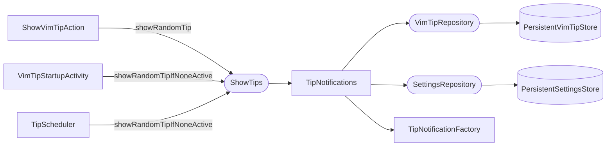

# Show Tip

Displays a random tip as an IntelliJ balloon notification. The same flow is triggered by three entry points: the `ShowVimTipAction` (user-invoked from Find Action), startup (after the tip cache is refreshed), and the periodic scheduler.

## Components



`ShowTips` is a project service. `TipNotifications` is its implementation. The interface has two methods:

- `showRandomTip()` — always shows a tip, expiring any currently visible one first.
- `showRandomTipIfNoneActive()` — skips silently if a tip balloon is already visible. Used by startup and the periodic scheduler so they don't interrupt the user.

## Tip Selection

`selectRandomTip()` in `TipNotifications` does two things before calling `.random()`:

1. **Category filter**: asks `SettingsRepository` for the enabled categories, then calls `VimTipRepository.getRandomTip(enabledCategories)`. If no categories are available yet (tips not loaded), falls back to `getRandomTip()` with no filter.

2. **Exclusion filter**: inside `VimTipRepositoryImpl.visibleTips()`, tips whose SHA-256 hash of the summary appears in the hidden-hashes list are stripped before the random draw. The hash is computed by `TipHash.fromTip()`.

`TipSelectionIndex` is a lazy cache inside `VimTipRepositoryImpl` that groups tips by category. It is rebuilt only when the tip list reference changes (after a refresh), not on every call.

Fallback tips are returned when the candidate list is empty after filtering:

| Condition | Fallback shown |
|-----------|----------------|
| No tips loaded at all | "No tips found." |
| All tips filtered out by category | "No tips match the selected categories." |

## Active Notification Tracking

`ActiveTipNotificationTracker` keeps a reference to the current tip notification per project. `hasVisibleNotification()` checks whether the tracked notification still has a live, non-disposed balloon — stale references are cleared and treated as absent. The tracker uses a lock because `replaceWith` and expiry callbacks can run on different threads.

## Exclude Flow

Clicking "Exclude tip" calls `ExcludeTipFromNotifications.exclude()`:

1. Computes `TipHash.fromTip(tip)` (SHA-256 of the trimmed summary).
2. Calls `settingsService.hideTip(hash)` — adds the hash to the persistent hidden list.
3. Expires the notification immediately.
4. Calls `settingsService.consumeExcludedTipsManagementHint()`. This returns `true` exactly once (on the first-ever exclusion) and flips a persistent flag. When it returns `true`, a secondary notification appears prompting the user to manage excluded tips in Settings.

## Notification Structure

`TipNotificationFactory` renders the tip as an HTML string. The layout is:

```html
<html><div>
  <b>summary</b>
  <div style="margin-top:12px;margin-bottom:12px;">detail line 1<br/>detail line 2</div>
</div></html>
```

Actions — "Next tip", "Exclude tip", and "Add to .ideavimrc" (when `tip.config` is non-empty) — are all standard `NotificationAction` buttons appended to the balloon.
